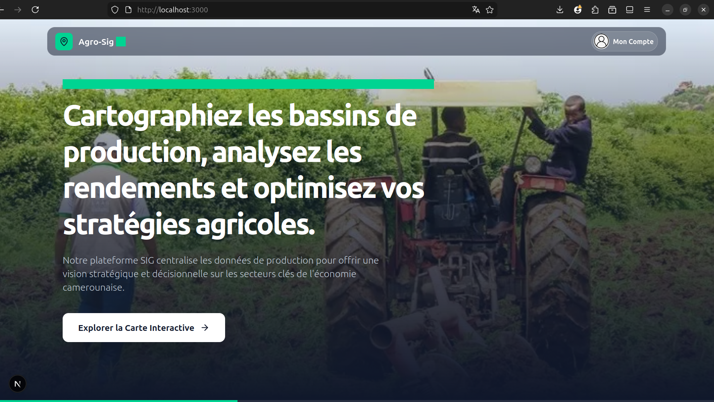
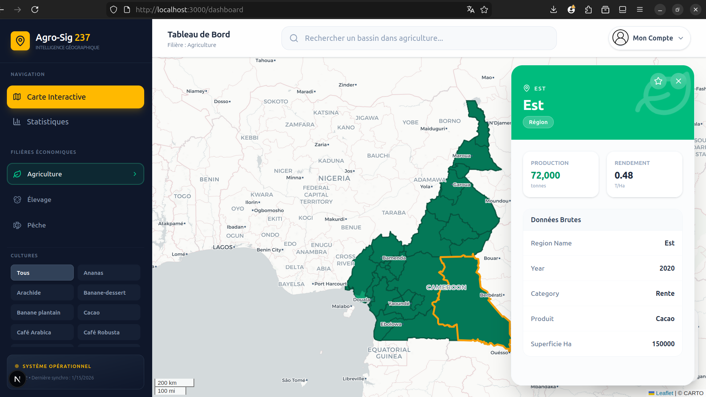

# Frontend - Agro-Sig 237

Interface utilisateur pour la plateforme de cartographie interactive des bassins de production au Cameroun. Ce projet est développé avec Next.js 16 (App Router), Tailwind CSS et React-Leaflet.

<div style="display: flex; gap: 16px;">
  
  
</div>

## Pré-requis

1.  Node.js (version 18 ou supérieure)
2.  Le projet Backend doit être installé et en cours d'exécution (port 3001 par défaut).
3.  GeoServer doit être installé et en cours d'exécution (port 8080 par défaut).

## Installation

1.  Cloner le dépôt ou copier les fichiers sources dans un répertoire.
```bash
git clone https://github.com/Ngo-Bassom-Anne-Rosa/CMR-SIG-WEB-MAPPING.FRONTEND.git frontend
```

2.  Ouvrir un terminal dans le répertoire du projet frontend.
```bash
cd frontend
```

3.  Installer les dépendances via npm :
```bash
npm install
```

## Configuration

Dupliquez le fichier `.env.example` et renommez-le en `.env`. Modifiez les valeurs pour correspondre à votre configuration locale :
```bash
NEXT_PUBLIC_API_URL=http://localhost:3001
NEXT_PUBLIC_GEOSERVER_URL=http://localhost:7900/geoserver/sig_cmr_web_mapping/wms
```

Vérifiez que les URLs pointent correctement vers vos services locaux. Si vous déployez l'application, modifiez ces valeurs en conséquence.

## Lancement

Pour démarrer le serveur de développement :
```bash
npm run dev
```

Ouvrez ensuite [http://localhost:3000](http://localhost:3000) dans votre navigateur pour voir le résultat.

## Fonctionnalités Principales

### Tableau de Bord (Dashboard)
- Visualisation cartographique interactive via Leaflet.
- Affichage des couches WMS depuis GeoServer.
- Filtrage par filière (Agriculture, Élevage, Pêche) et par produit.
- Panneau latéral (Side Drawer) affichant les détails d'une zone au clic (via WFS/WMS GetFeatureInfo).

### Statistiques
- Visualisation de données agrégées (Graphiques en aires, Diagrammes circulaires).
- Comparateur de bassins : Permet de confronter les données de deux zones géographiques (Régions ou Départements).
- Indicateurs clés de performance (KPI) : Production totale, rendement, meilleure zone.
- Export des données en format CSV ou Shapefile (SIG).

### Profil Utilisateur
- Authentification (Connexion/Inscription).
- Gestion du profil (Nom, Prénom).
- Gestion des favoris : Sauvegarde rapide des zones géographiques d'intérêt.

## Architecture Technique

- Framework : Next.js 16
- UI : Tailwind CSS, Lucide React (icônes).
- Cartographie : React-Leaflet, Leaflet.
- Graphiques : Recharts.
- API Proxy : Les routes d'authentification (`/app/api/auth`) agissent comme un proxy vers le backend pour sécuriser les échanges.